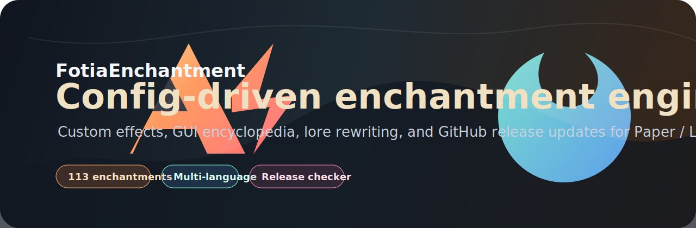
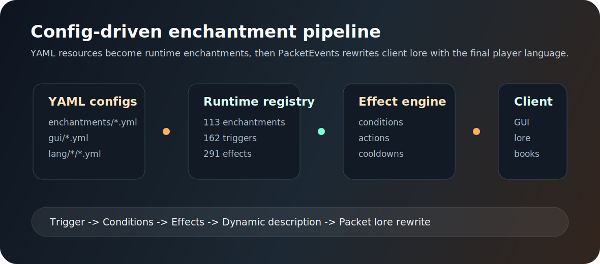
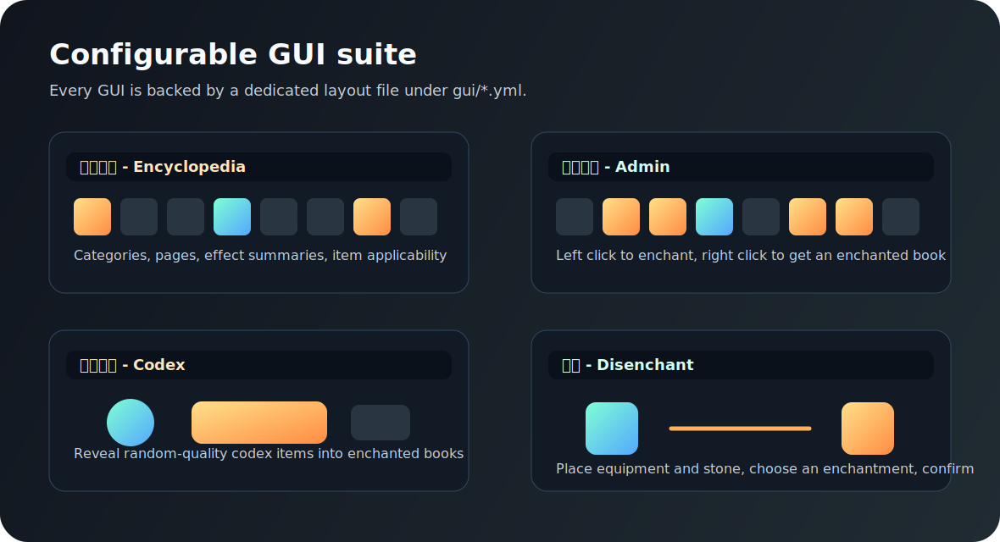
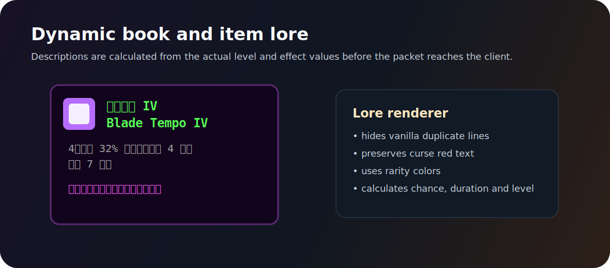
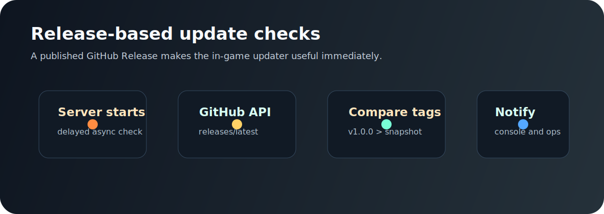

# FotiaEnchantment

FotiaEnchantment 是一个面向 Paper / Leaf 服务器的配置驱动附魔插件。它把附魔触发器、条件、效果、GUI、语言文本和物品展示拆成可配置资源，让服主可以在不改 Java 代码的情况下扩展大量玩法。

[](https://adoptium.net/)
[](https://papermc.io/)
[](https://github.com/Ti-Avanti/FotiaEnchantment/releases/latest)
[](LICENSE)

## 视觉预览









## 核心特性

- **配置驱动附魔**：内置 113 个附魔配置，支持近战、远程、护甲、工具、通用等不同玩法方向。
- **触发器 / 条件 / 效果管线**：附魔可以按攻击、受伤、移动、挖掘、回血、交互等事件触发，并组合条件与效果。
- **完整 GUI 系统**：附魔图鉴、管理 GUI、碎片合成、魔典开启、祛魔界面均使用 `gui/*.yml` 字符布局配置。
- **客户端 Lore 重写**：通过 PacketEvents 重写物品展示，支持稀有度颜色、诅咒红色、动态等级描述与原版附魔行隐藏。
- **多语言资源**：内置 `zh_cn`、`zh_tw`、`en_us`、`ja_jp`、`ko_kr` 语言目录；缺失客户端语言时回退到默认语言。
- **GitHub Release 更新检测**：启动时异步检查 GitHub 最新 Release，不阻塞服务器主线程。

## 运行环境

- Java 21
- Minecraft 1.21.x
- Paper / Leaf
- 可选依赖：PlaceholderAPI、WorldGuard、AuraSkills、mcMMO、MythicMobs、PacketEvents、CraftEngine

> 物品 Lore 重写依赖 PacketEvents。未安装时插件仍可运行，但客户端附魔展示接管能力会受限。

## 安装

1. 从 [Releases](https://github.com/Ti-Avanti/FotiaEnchantment/releases/latest) 下载最新 `FotiaEnchantment-*.jar`。
2. 放入服务器 `plugins/` 目录。
3. 启动服务器，插件会自动生成配置文件。
4. 修改配置后执行 `/fe reload`。

## 常用命令

| 命令 | 权限 | 说明 |
| --- | --- | --- |
| `/fe gui` | `fotia.enchantment.use` | 打开玩家附魔图鉴 |
| `/fe gui admin` | `fotia.enchantment.gui` | 打开管理员附魔管理界面 |
| `/fe list [category] [page]` | `fotia.enchantment.list` | 查看附魔列表 |
| `/fe info <enchant_id>` | `fotia.enchantment.info` | 查看附魔详情 |
| `/fe enchant <enchant_id> <level>` | `fotia.enchantment.enchant` | 给手持物品附魔 |
| `/fe give <player> <enchant_id> <level>` | `fotia.enchantment.give` | 给玩家手持物品附魔 |
| `/fe giveitem <player> <item_type> [amount] [rarity]` | `fotia.enchantment.giveitem` | 发放插件自定义道具 |
| `/fe reload` | `fotia.enchantment.reload` | 重载配置 |

## 配置结构

```text
plugins/FotiaEnchantment/
├─ config.yml
├─ rarity.yml
├─ groups.yml
├─ limits.yml
├─ enchantments/
├─ gui/
├─ items/
├─ lang/
└─ vanilla/
```

### GUI 布局

每个 GUI 都有独立文件，例如：

```yaml
size: 54
title: "<!i><dark_gray>附魔图鉴"
layout:
  - "#########"
  - "#AAAAAAA#"
  - "#AAAAAAA#"
  - "#AAAAAAA#"
  - "#P##I##N#"
  - "#########"
roles:
  enchantment: A
  previous-page: P
  info: I
  next-page: N
```

`layout` 中每个字符对应一个槽位，`roles` 把字符绑定到功能位，`items` 控制材质、名称、Lore、模型数据和 tooltip 样式。

### 更新检测

`config.yml` 中的 `update-checker` 会检查 GitHub 最新 Release：

```yaml
update-checker:
  enabled: true
  owner: Ti-Avanti
  repository: FotiaEnchantment
  api-url: "https://api.github.com/repos/{owner}/{repository}/releases/latest"
  download-url: "https://github.com/{owner}/{repository}/releases/latest"
  check-on-startup: true
  check-delay-seconds: 5
  notify:
    console: true
    ops: true
```

Release 标签建议使用 `v1.0.0`、`v1.1.0` 这类语义化版本。插件会把 `1.0.0-SNAPSHOT` 视为低于正式版 `1.0.0`。

## 从源码构建

```bash
mvn clean package
```

构建完成后使用：

```text
target/FotiaEnchantment-1.0.0-SNAPSHOT.jar
```

## 开源协议

本项目使用 [MIT License](LICENSE) 开源。
